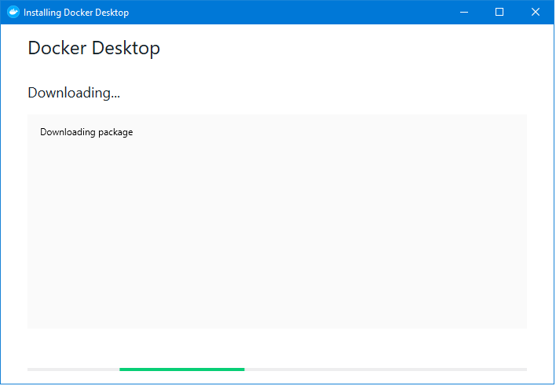
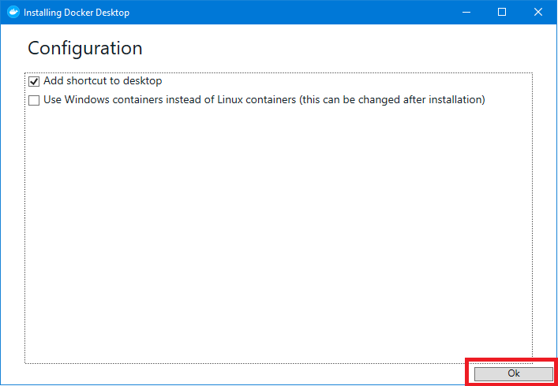
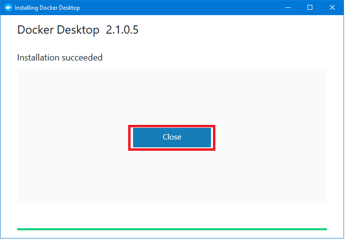
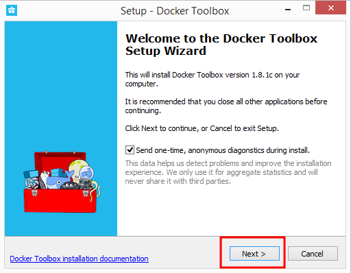

# Instalação do Docker para Microsoft Windows 10 

Esta página apresenta os passos para instalação e configuração do Docker no Microsoft Windows (7 ao 10). 


A instalação não é igual para todas as versões do Windows.
Por tanto, verifique a versão de seu sistema operacional e escolha o tutorial abaixo corresponte a ela.

* [Windows 10 Professional, Enterprise e Education](#Instalação-do-Docker-no-Windows-10-Professional,-Enterprise-e-Education)
* [Windows 10 Home ou inferior](#Instalação-do-Docker-no-Windows-10-Home-ou-Inferior)

## Instalação do Docker no Windows 10 Professional, Enterprise e Education

**1.** Para iniciar, acesse a [página de *download* do Docker](https://www.docker.com/get-started). Nesta página, clique na opção `Download Desktop and Take a Tutorial`:


**2.** Ao clicar neste botão, você será redirecionado para a página de *login* do DockerHub. Caso precise criar uma conta, utilize a opção `Sign Up`:


**3.** Nessa página crie uma conta. Ela será necessaria para Download e uso do Docker.


**4.** Após fazer o *login*, a página a qual você será direcionado possui o botão `Download Docker Desktop for Windows`, clicando neste você já estará realizando o *download* do instalador:


**5.** Com a janela de download aberta, clique em `Save File`:


**6.** Com o final do *download*, execute o arquivo `Docker Desktop Installer`:

 

**7.** Os pacotes necessários para a instalação do Docker serão baixados:



**8.** Depois dos pacotes baixados, algumas opções de instalação serão exibidas. Mantenha somente a opção `Add shortcut to desktop`:



**9.** Essa janela mostra apenas que o processo de instalação encontra-se em progresso:


**10.** Ao final da instalação uma janela como mostrada abaixo será apresentada. Presisone `Close` para finalilzar a instalação:

 

**11.** Com o processo finalizado, faça a execução do Docker através do atalho na Área de trabalho ou no menu:


Quando a execução for feita, o seguinte *pop-up* será exibido, indicando que tudo foi instalado com sucesso:


**12.** Por fim, quando toda a ferramenta estiver inicializada, uma página de *login* será exibida, preencha esta com suas informações e conclua a instalação do Docker.


> Para acessar imagens a partir do Docker Hub é necessário realizar o login.


**Observação:** Mais informações sobre a instalação podem ser encontradas em: [Docker](https://docs.docker.com/install/).


## Instalação do Docker no Windows 10 Home ou inferior

**1.** Para executar o Docker corretamente, o seu sistema operacional Windows precisa ser da arquitetura 64-bits e a virtualização precisa estar habilitada. Siga os passos abaixo para verificar se o seu sistema atende estes requisitos:

* Para verificar a arquitetura do sistema, abra o Prompt de Comando e execute o código abaixo:
    ```bash
    wmic os get osarchitecture
    ```
    
    Caso o resultado do prompt retorne a mensagem **OSAcrchitecture 64 bits**, semelhante ao resultado abaixo, então o seu sistema é de 64 bits:
    ```bash
    OSArchitecture
    64 bits
    ```

* Para verificar se a virtualização está habilitada, abra o Prompt de Comando e execute o código abaixo:
    ```bash
    systeminfo
    ```
    Provavelmente, você irá ver uma seção de **Requisitos do Hyper-V**, como demonstra o resultado abaixo:
    
    * **Obs**: Caso essa seção não apareça, o hardware não possuí suporte a virtualização. Dessa forma, o **Docker não poderá ser instalado**.
    ```text
    Requisitos do Hyper-V:  Extensão de Modo de Monitor VM: Sim
                            Virtualização Habilitada no Firmware: Sim
                            Conversão de Endereços de Segundo Nível: Sim
                            Prevenção de Execução de Dados Disponível: Sim
    ```

    Se a virtualização estiver habilitada, você irá ver um **Sim** após **Virtualização Habilitada no Firmware**. Caso apareça **Não**, você deve seguir as instruções do fabricante para habilitar essa opção.


**2.** Com o sistema operacional e hardware atendendo todos os requisitos, baixe através do link abaixo a aplicação Docker Toolbox.

```text
https://github.com/docker/toolbox/releases/download/v19.03.1/DockerToolbox-19.03.1.exe
```

**3.** Instale o Docker Toolbox clicando duas vez no instalador que foi baixado.


**4.** Uma janela escrita "Setup - Docker Toolbox" será iniciada. Se uma janela de segurança do Windows solicitar que você permita que o programa faça uma alteração, escolha **Sim**.



**5.** Escolha o botão **Next** para aceitar todas as configurações padrões e então instalar o Docker Toolbox. Caso seja solicitado permissão através de uma janela de segurança do Windows, permita para que o instalador faça as alterações necessárias.

**6.** Quando finalizado, o instalador irá informa que foi bem-sucedido:


**7.** O instalador irá adicionar três ícones no diretório **Desktop**. Procure pela aplicação **Docker QuickStart Terminal** e clique duas vez em seu ícone. 


**8.** Será iniciado um terminal Docker Toolbox pré-configurado semelhante a imagem abaixo. Aguarde até que o programa conclua as suas configurações.


**9.** Para verificar se a instalação foi concluída com sucesso, execute no terminal o comando abaixo:

```bash
docker run hello-world
```

**10.** Se tudo estiver funcionando corretamente, o comando irá retornar algo parecido com a mensagem abaixo:

```bash
 $ docker run hello-world
 Unable to find image 'hello-world:latest' locally
 Pulling repository hello-world
 91c95931e552: Download complete
 a8219747be10: Download complete
 Status: Downloaded newer image for hello-world:latest
 Hello from Docker.
 This message shows that your installation appears to be working correctly.

 To generate this message, Docker took the following steps:
  1. The Docker Engine CLI client contacted the Docker Engine daemon.
  2. The Docker Engine daemon pulled the "hello-world" image from the Docker Hub.
     (Assuming it was not already locally available.)
  3. The Docker Engine daemon created a new container from that image which runs the
     executable that produces the output you are currently reading.
  4. The Docker Engine daemon streamed that output to the Docker Engine CLI client, which sent it
     to your terminal.

 To try something more ambitious, you can run an Ubuntu container with:
  $ docker run -it ubuntu bash

 For more examples and ideas, visit:
  https://docs.docker.com/userguide/
```

