# Instalação do PostgreSQL/PostGIS para Microsoft Windows 10

## Instalação do PostgreSQL 11.6

Na página de download do [PostgreSQL](https://www.postgresql.org/download/), selecione a opção `Windows`, como mostrado na figura abaixo.

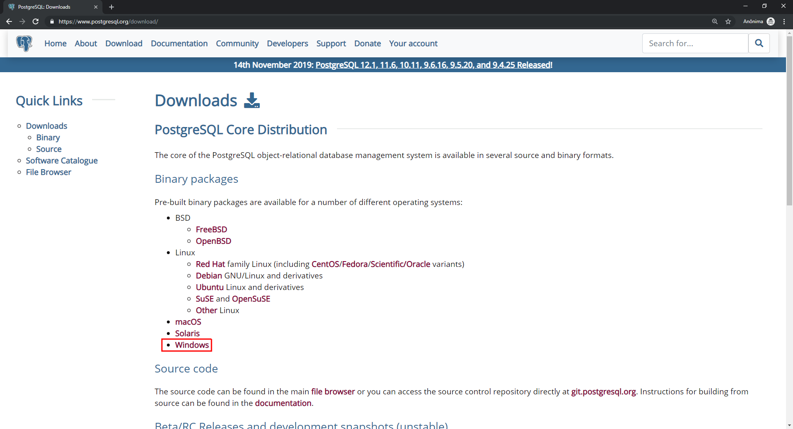

Ao selecionar a opção `Windows` você será redirecionado para a página de instaladores do Windows. Acesse o *link* `Download the installer` como mostrado a seguir:

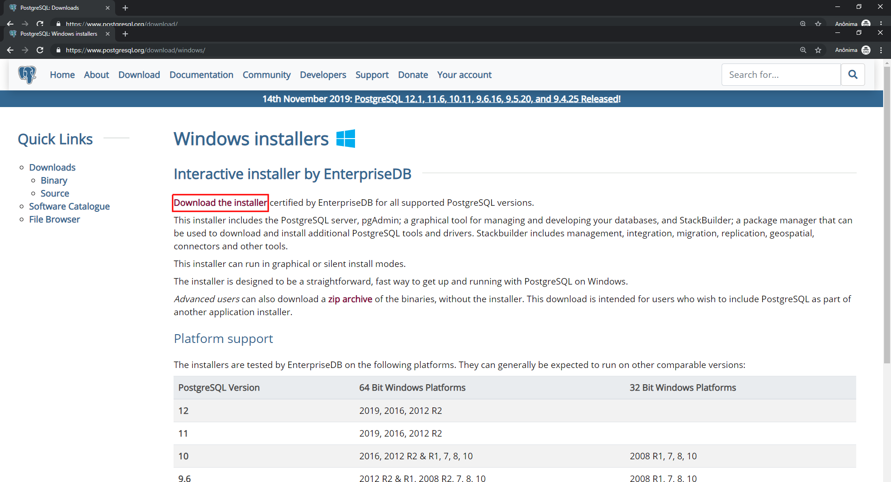

Após o acesso, é exibida uma tabela de opções de instaladores. Selecione a opção `PostgreSQL Version` `11.6` para `Windows x86-64` como indicado na figura.

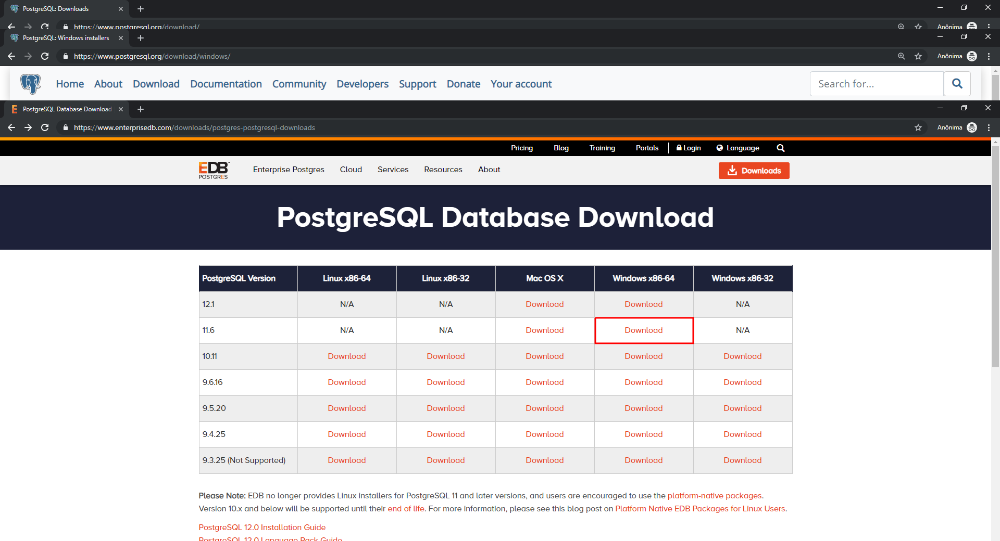

Após o download ser concluído, siga os passos apresentados a seguir:

**1.** No diretório de Downloads do Windows, abra o instalador `postgresql-11.6-3-windows-x64`:

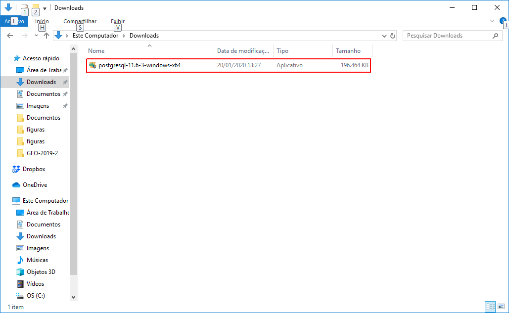

**2.** Após iniciar o instalador, será exibida uma janela para configuração do PostgreSQL (`Setup - PostgreSQL`). Pressione `Next >` para continuar.

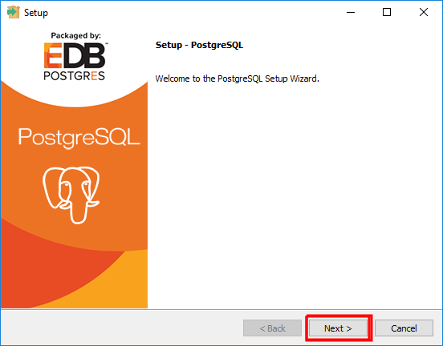

**3.** Se você possui um disco SSD de pequeno porte, sugerimos alterar o local da pasta de destino do PostgreSQL para um disco com maior capacidade. Aponte para o diretório que você deseja instalar o PostgreSQL e pressione `Next >` para continuar.

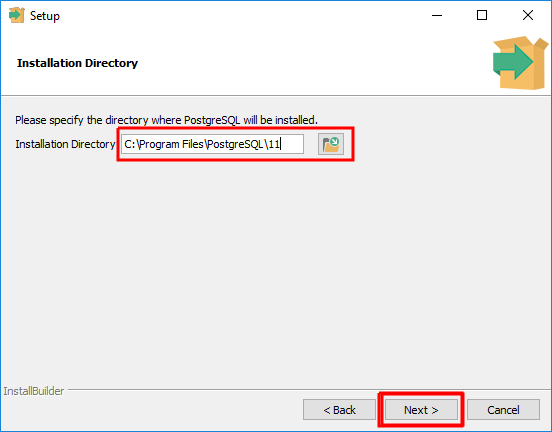

**4.** O instalador irá apresentar as opções de componentes a serem instalados. Selecione as opções de acordo com a imagem a seguir, e pressione `Next >` para continuar.

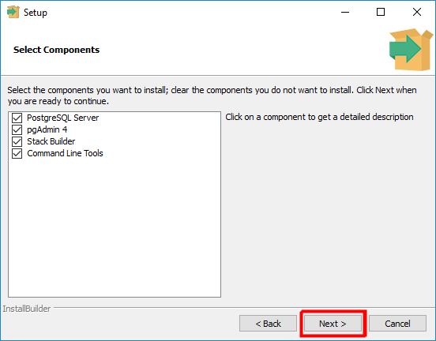

**5.** Assim como no **passo 3**, se você possui um disco SSD de pequeno porte, sugerimos alterar o local da pasta de destino dos dados a serem armazenados para um disco com maior capacidade. Aponte para a pasta desejada e pressione `Next >` para continuar.

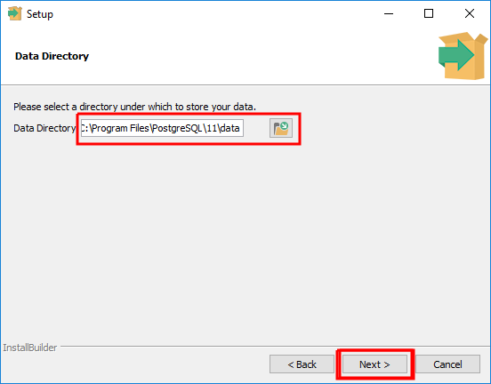

**6.** Defina uma senha para o superusuário postgresql, e pressione `Next >` para continuar.

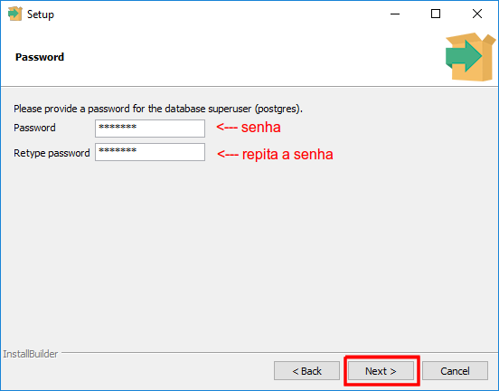

**7.** Selecione o número da porta desejada para o servidor PostgreSQL. Por padrão define-se o número de porta `5432`. Caso a porta `5432` já esteja em uso por outra aplicação, utilize outro número de porta para o servidor PostgreSQL. Pressione `Next >` para continuar.

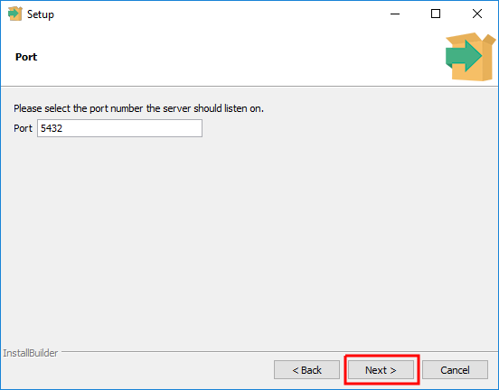

**8.** Na etapa de opções avançadas (`Advanced Options`) mantenha `Locale` definido como apresentado na figura abaixo, e pressione `Next >` para continuar

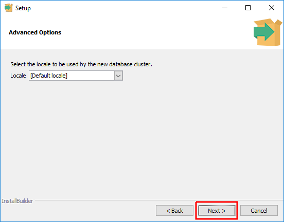

**9.** A próxima janela apresenta um resumo das opções de configuração que serão utilizadas na instalação do PostgreSQL. Pressione `Next >` para continuar.

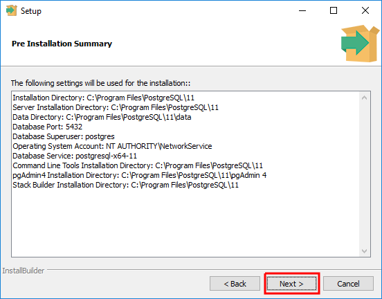

**10.** Essa janela mostra apenas que o processo de instalação encontra-se em progresso:

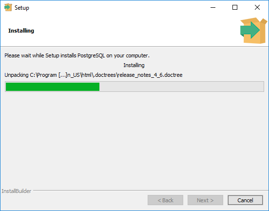

**11.** Ao final da instalação, uma janela como mostrada abaixo será apresentada. Mantenha a opção `Stack Builder` selecionada. Pressione `Finish` para finalilzar a instalação do PostgreSQL:

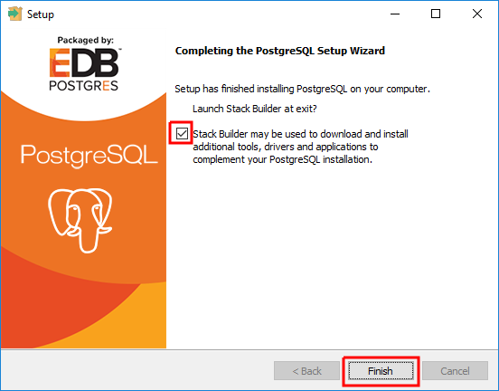

## Instalação do PostGIS 2.5

Mantendo a opção `Stack Builder` selecionada ao final da instalação do PostgreSQL, será apresentada uma nova janela de instalação (`Stack Builder 4.2.0`). O `Stack Builder` é utilizado para fazer o download e instalação de ferramentas e aplicações adicionais ao PostgreSQL.

O `Stack Builder` será utilizado para instalação da extensão espacial PostGIS, para isto, siga os passos apresentados a seguir:

**1.** Na primeira janela exibida pelo `Stack Builder` é apresentada a versão (ou versões) do PostgreSQL instalada no sistema. Selecione a opção `PostgreSQL 11(x64)` como mostrado na figura abaixo e pressione `Next >` para continuar.

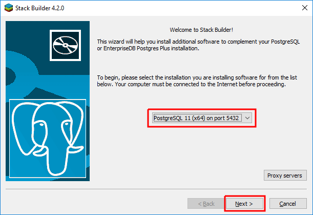

**2.** No item de `Categories`, abra o subitem `Spatial Extensions` e selecione a opção `PostGIS 2.5 Bundle for PostgreSQL 11 (64bit) v2.5.3` como ilustrado na próxima figura. Pressione `Next >` para continuar.

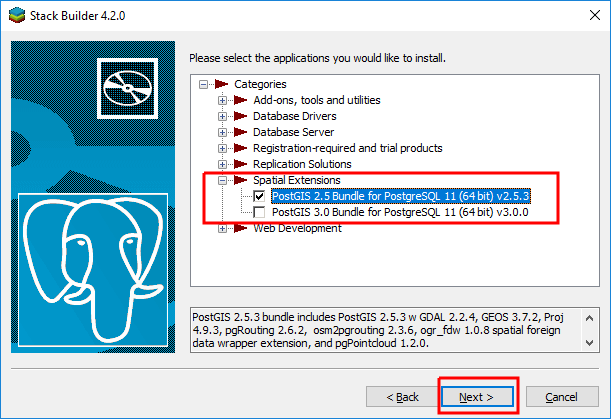

**3.** Aponte para o diretório que você deseja realizar o download do instalador PostGIS e pressione `Next >` para continuar.

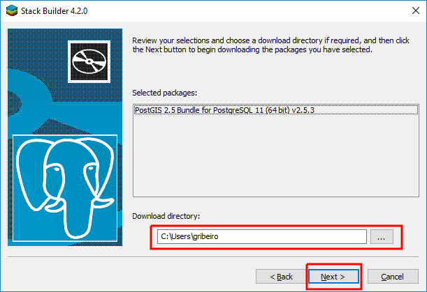

**4.** Conforme apresenta a próxima imagem, mantenha a opção `Skip Installation` desmarcada e pressione `Next >` para iniciar a instalação do PostGIS.

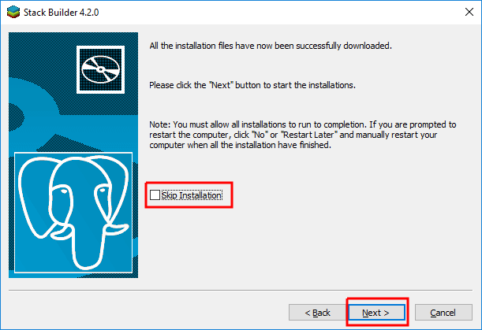

**5.** Ao final do processo de download será exibida uma nova janela para dar continuidade a instalação do PostGIS. O PostGIS é baseado em diversos softwares livres. Nessa janela você deverá aceitar os termos da licença do PostGIS e de outros sistemas ou bibliotecas. Pressione `I Agree >` para continuar:

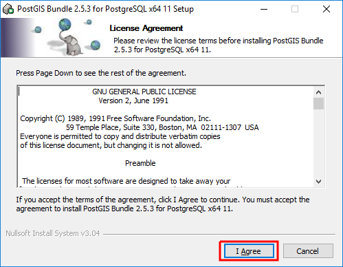

**6.** Na opção de componentes a serem instalados, selecione conforme indicado na figura e pressione `Next >`.

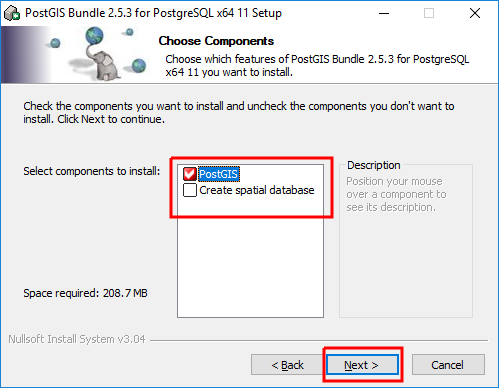

**7.** Aponte para o diretório que você deseja instalar o PostGIS e pressione `Next >`.

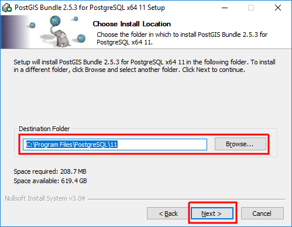

**8.** Essa janela mostra apenas que o processo de instalação do PostGIS encontra-se em progresso:

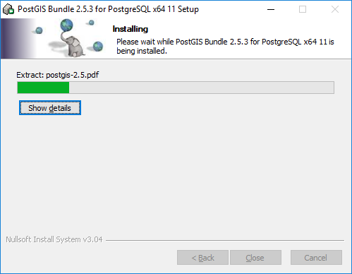

**9.** Selecione `Sim (Yes)`para registrar a variável de ambiente `GDAL_DATA` como apresentado abaixo:

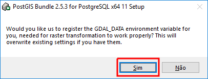

**10.** Selecione `Sim (Yes)` para habilitar os drives de dados raster, registrando a variável de ambiente `POSTGIS_GDAL_ENABLED_DRIVERS`.

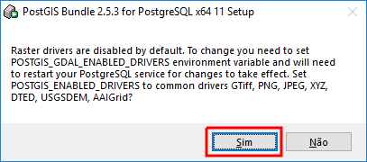

**11.** Selecione `Sim (Yes)`para registrar a variável de ambiente `POSTGIS_ENABLE_OUTDB_RASTERS` como indicado.

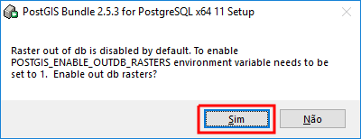

**12.** Se o processo de instalação foi realizado com sucesso, uma janela como mostrada abaixo será apresentada. Pressione `Close` para finalilzar a instalação:

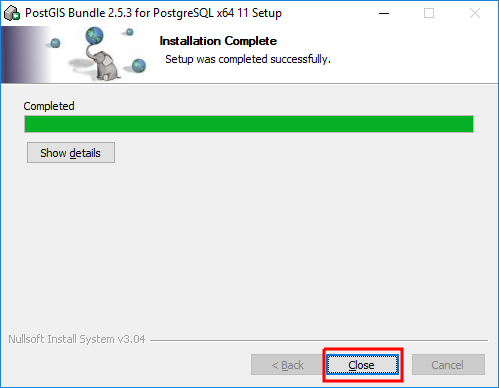

**13.** Ao final da instalação, será apresentada a janela do `Stack Builder` confirmando o processo de instalação do PostGIS. Pressione `Finish` para finalilzar o processo.

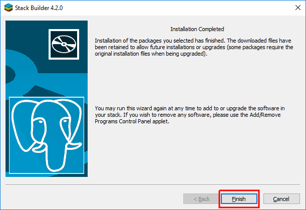

## Testando a instalação do PostgreSQL/PostGIS para Microsoft Windows 10

O PostgreSQL/PostGIS pode ser acessado através de diferentes formas. Utilizaremos a aplicação `pgAdmin4` (instalado durante o processo de instalação do PostgreSQL).

No menu de aplicações do Windows 10 encontre e inicialize o `pgAdmin 4` como indicado na figura abaixo:

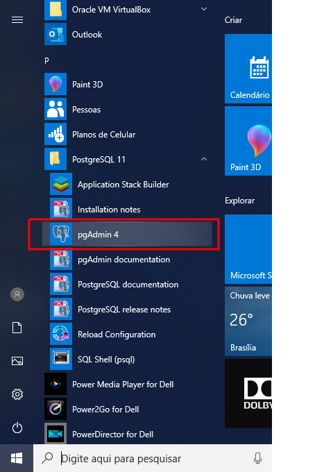

No primeiro acesso ao `pgAdmin 4`, será necessário definir uma senha (aplicável apenas a usuários do modo de área de trabalho) que irá ser utilizada para proteger e desbloquear posteriormente as senhas salvas do servidor. Pressione `OK` para continuar

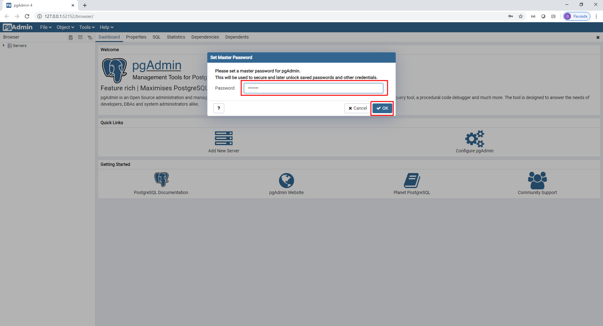

Ao inicializar o `pgAdmin 4`, uma janela como a mostrada abaixo será exibida:

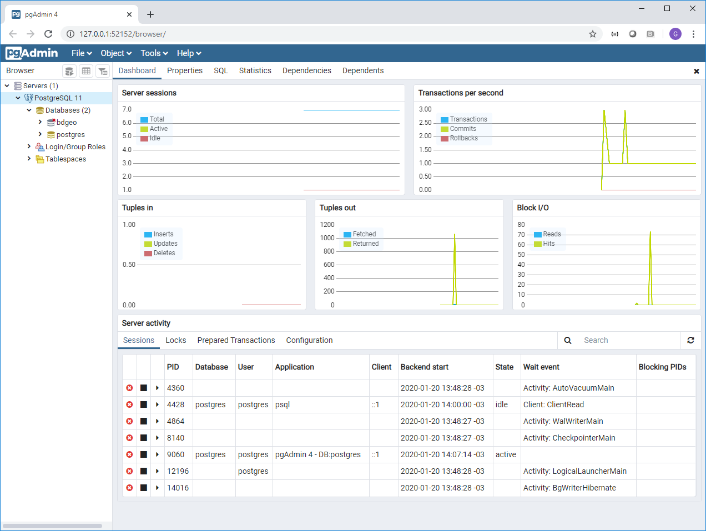
