# Instalação do QGIS para macOS

Na página principal do aplicativo [QGIS](https://qgis.org/en/site/), selecione a opção `Download Now`, como mostrado na figura abaixo.

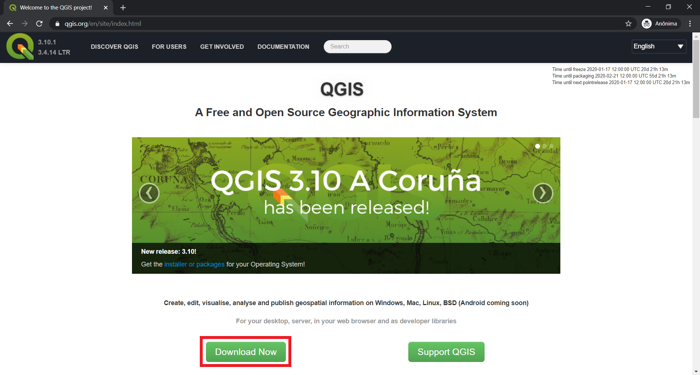

Na página de [Downloads](https://qgis.org/en/site/forusers/download.html), selecione a opção `Download for macOS` e baixe a versão `QGIS macOS Installer Version 3.4`, conforme mostrado na figura abaixo.

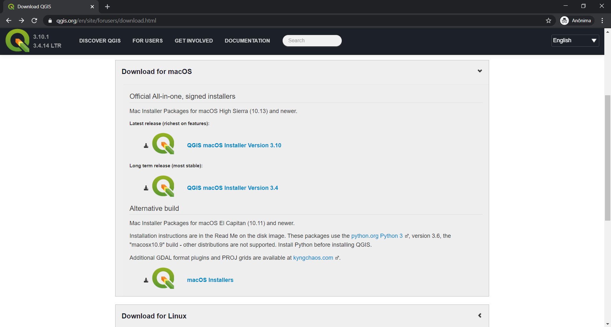

Após concluir o download do instalador, siga os passos mostrados a seguir:

**1.** Abra o instalador. Uma janela como a mostrada abaixo será aberta. O QGIS é baseado em diversos softwares livres. Nessa janela você deverá aceitar os termos da licença do QGIS e de outros sistemas ou bibliotecas. Pressione `Agree` para continuar:

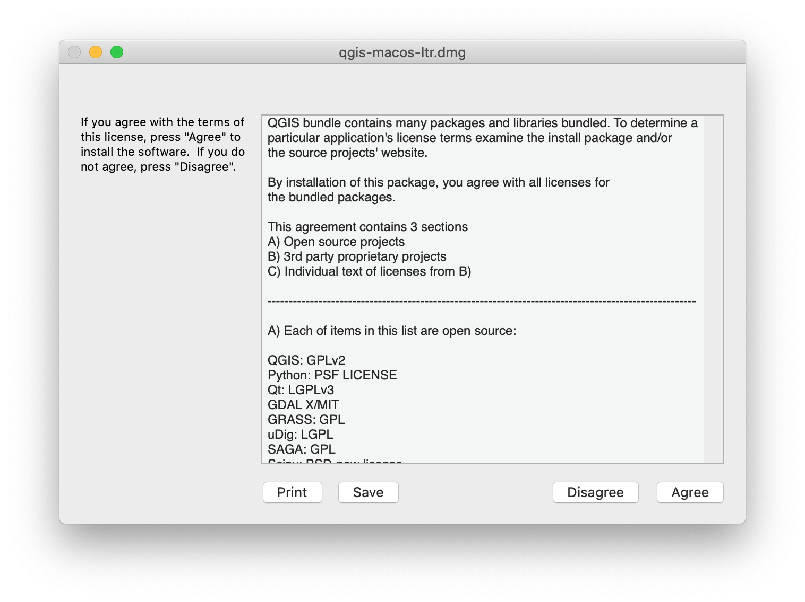

**2.** Em seguida, será realizada uma verificação do pacote de instalação:

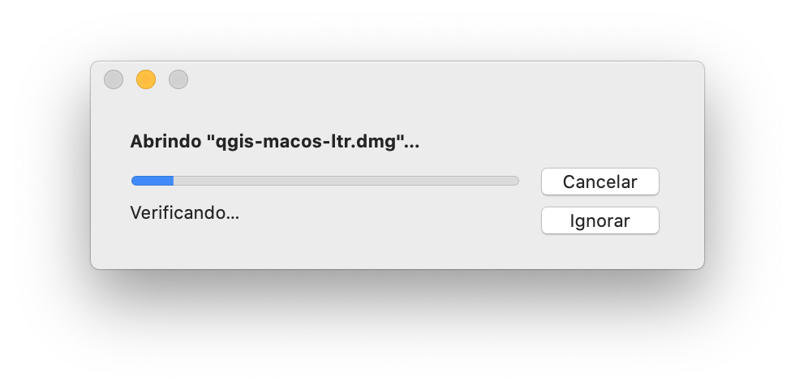

**3.** Após a verificação, será aberta uma nova janela que possibilitará que você arraste o símbolo do QGIS para a pasta de aplicações (`Applications`).

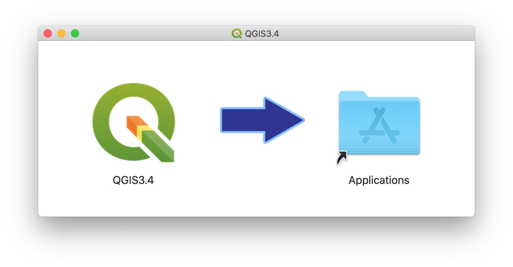

**4.** O conteúdo do pacote será copiado para a pasta de aplicações:

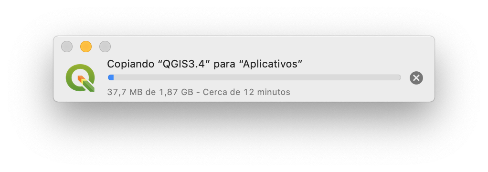

**5.** Durante alguns minutos, o ícone do `QGIS` na janela de aplicativos é apresentado desabilitado, como mostrado na figura abaixo:

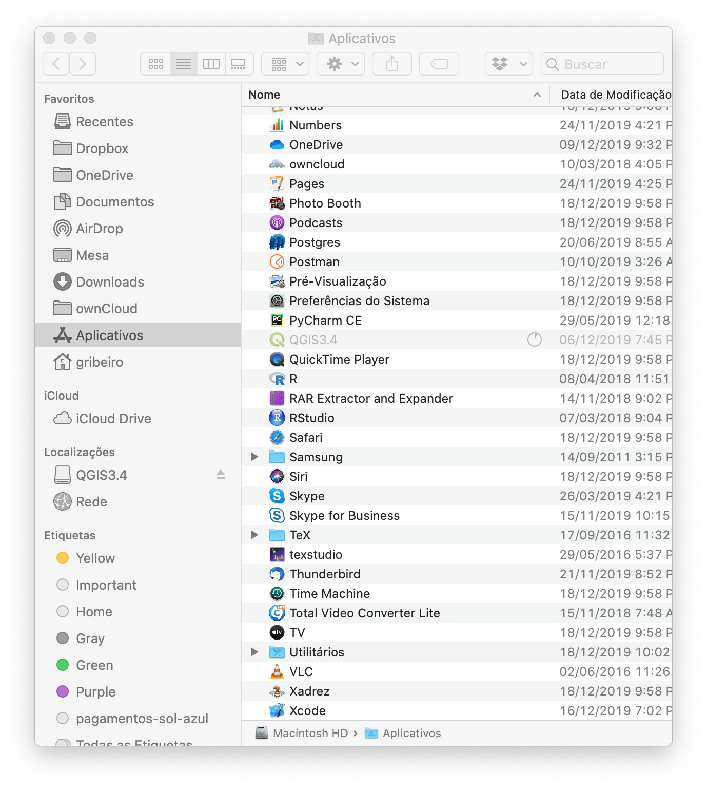

**6.** Ao final da instalação o ícone do QGIS estará habilitado na pasta de aplicativos, como mostradado abaixo:

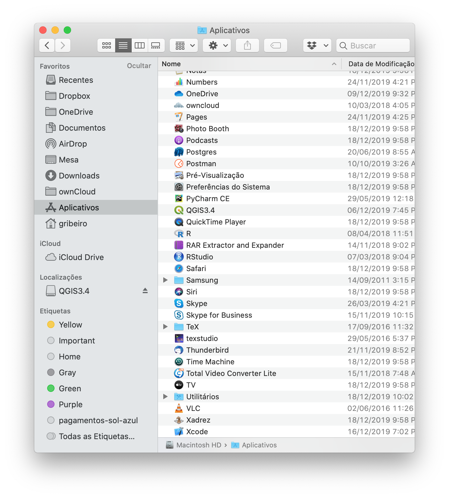

**7.** Através do ícone do QGIS na janela acima ou do *Launchpad* (janela abaixo), execute o aplicativo QGIS Desktop:

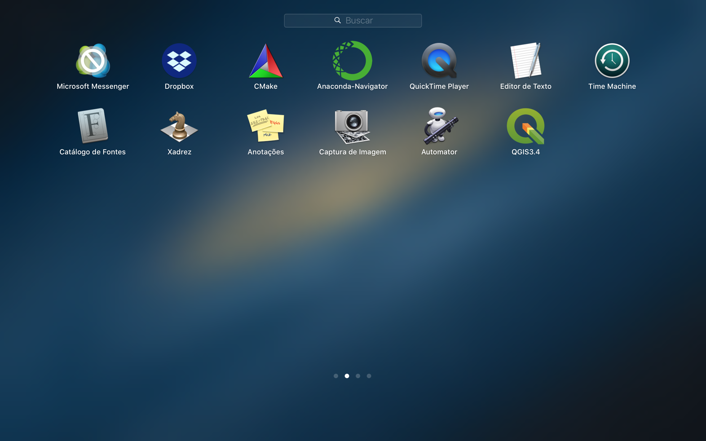

**8.** Em alguns casos, o `macOS` pode apresentar uma janela de aviso indicando que o QGIS não pode ser aberto. Neste caso, abra a janela de preferências do `macOS` e selecione a opção segurança. Pressione a opção 'Abrir mesmo assim' para permitir a inicialização do QGIS:

<!-- Se uma janela for apresentada indicando que o QGIS não pode ser aberto, abra abra a janela de preferências do macOS e selecione a opção segurança, indicando que deseja abrir o aplicativo QGIS: -->

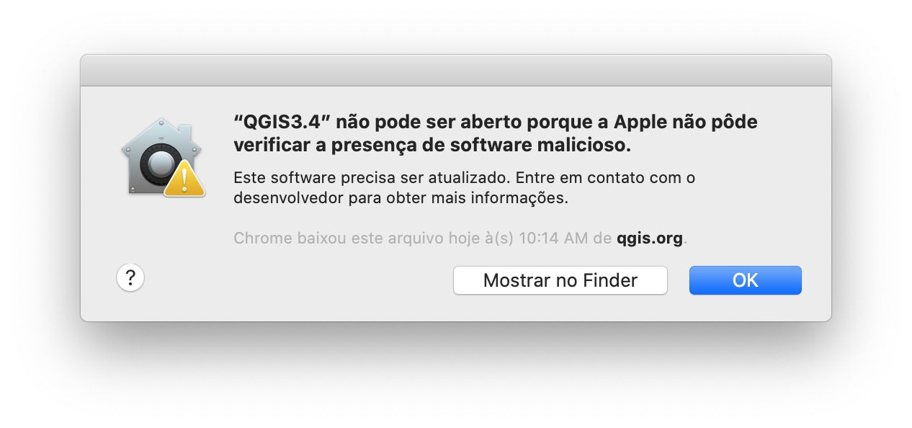

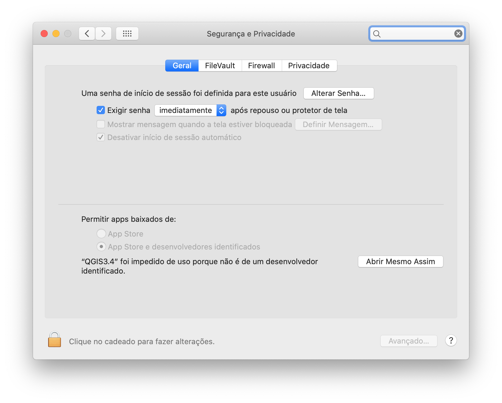

**9.** Se a instalação foi concluída com sucesso, ao iniciar o aplicativo `QGIS`, uma janela como a mostrada abaixo será exibida:

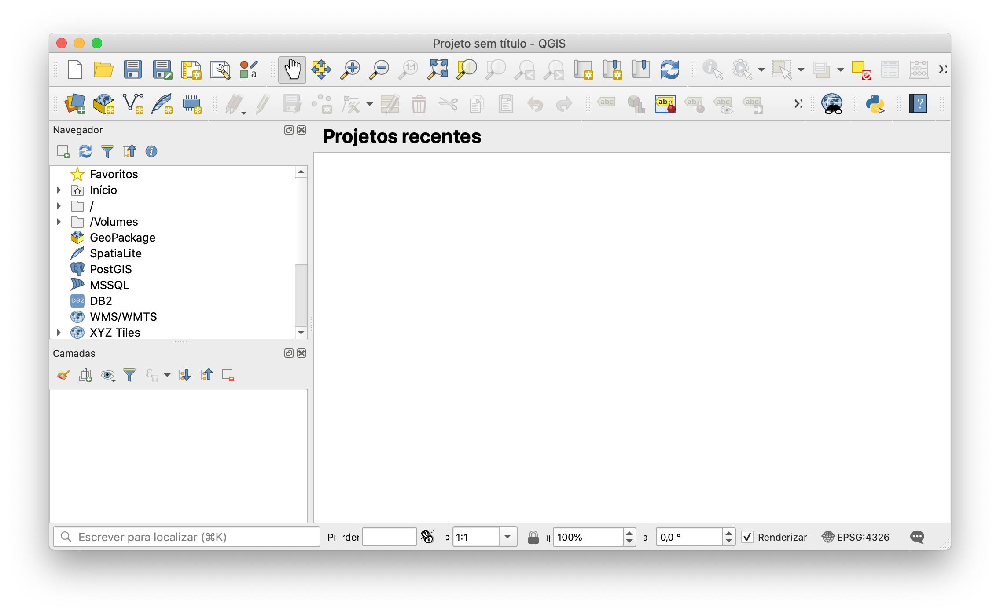

**Observação:** Mais informações sobre a instalação no `macOS` podem ser encontradas em: [QGIS Installers](https://www.qgis.org/en/site/forusers/alldownloads.html#mac-os-x-macos).
