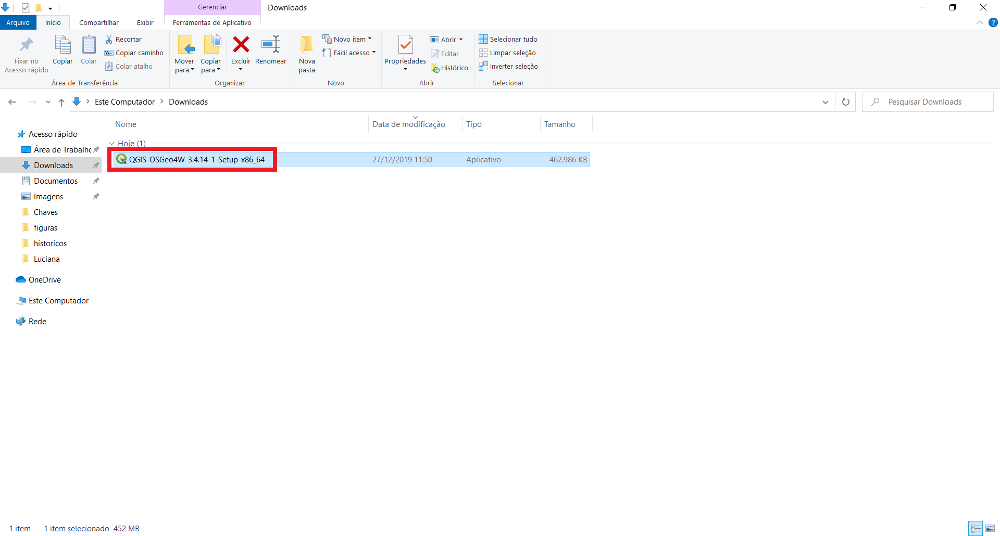
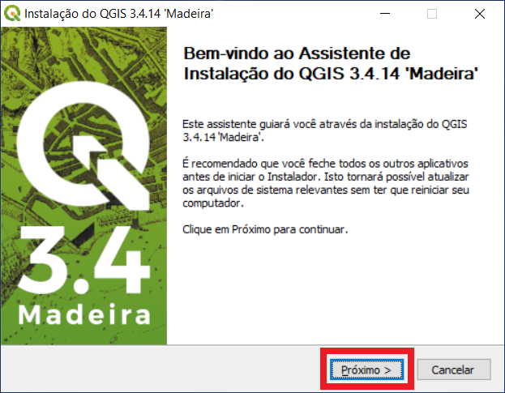
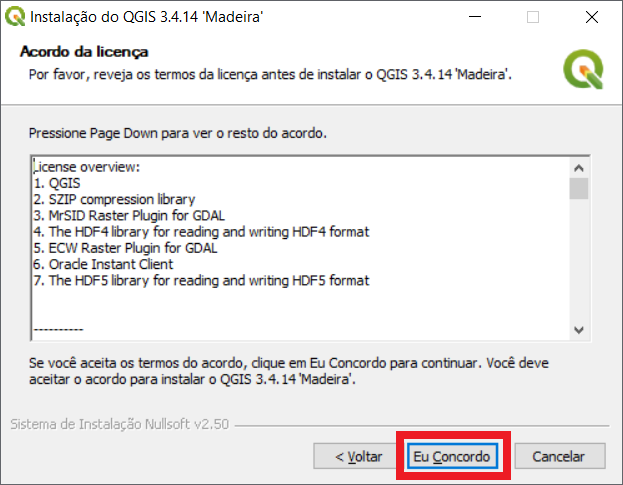
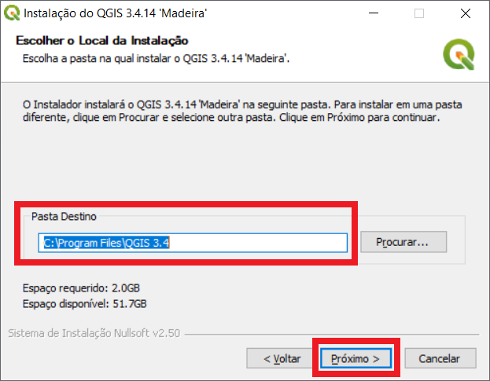
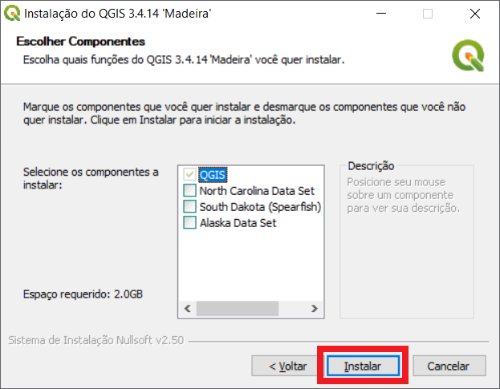
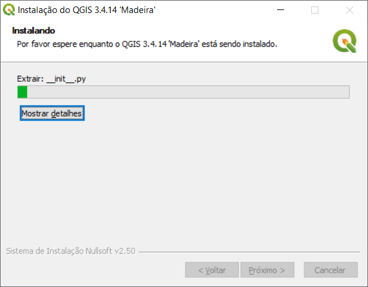
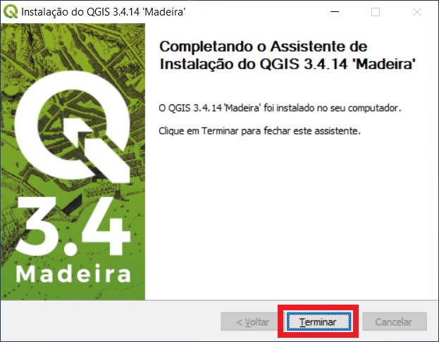
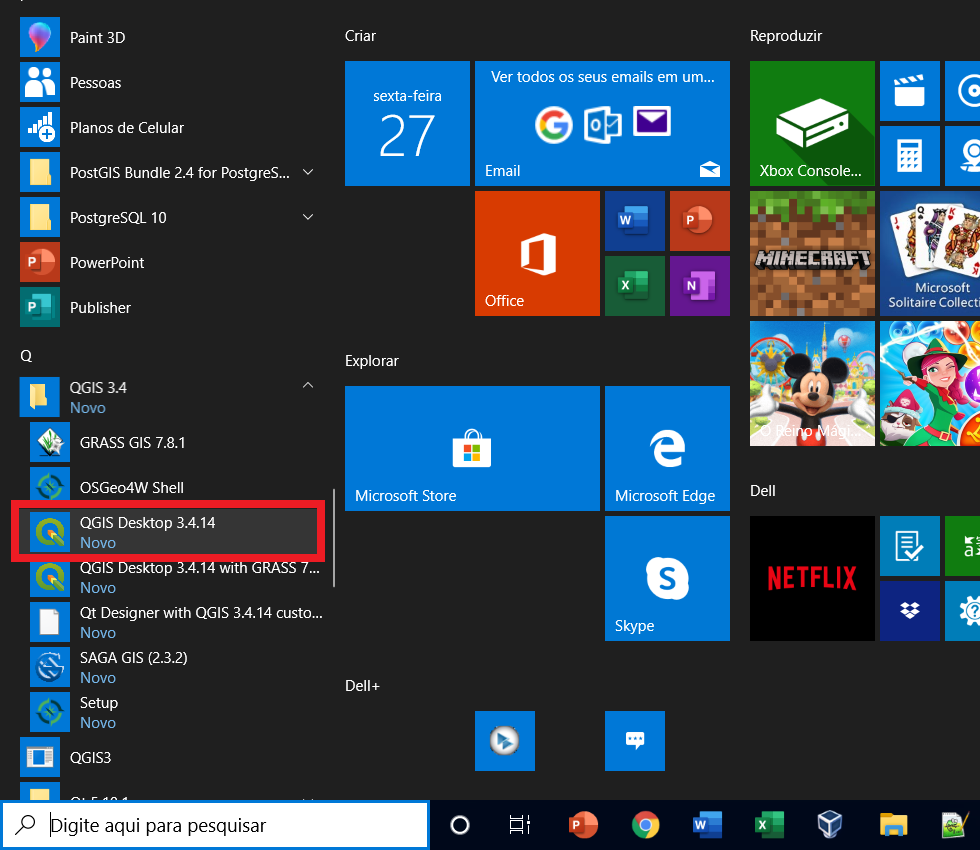
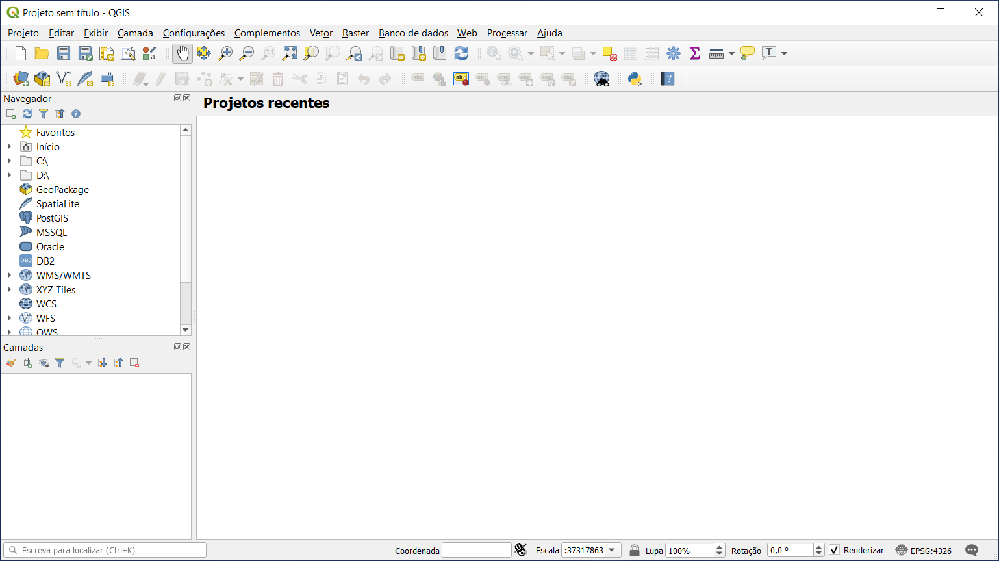

# Instalação do QGIS para Microsoft Windows 10

Na página principal do aplicativo [QGIS](https://qgis.org/en/site/), selecione a opção `Download Now`, como mostrado na figura abaixo.

Na página de [Downloads](https://qgis.org/en/site/forusers/download.html), selecione a opção `Download for Windows` e baixe a versão `QGIS Standalone Installer Version 3.4 (64 bit)`, conforme mostrado na figura abaixo.

")

Após concluir o download do instalador, siga os passos mostrados a seguir:

**1.** Abra o instalador:

**2.** Uma janela com o logo do QGIS será aberta. pressione `Próximo` para continuar:

**3.** O QGIS é baseado em diversos softwares livres. Nessa janela você deverá aceitar os termos da licença do QGIS e de outros sistemas ou bibliotecas. Pressione `Eu Concordo` para continuar:

**4.** Se você possui um disco SSD de pequeno porte, sugerimos alterar o local da pasta de destino do QGIS para um disco com maior capacidade, pois a instalação irá ocupar em torno de `1.93GB`. Aponte para a pasta desejada e pressione `Próximo` para continuar:

**5.** Nessa janela você não precisará baixar os dados de exemplo, pois preparamos diversos conjuntos de dados para o curso que serão compartilhados com todos. Pressione `Instalar` para continuar:

**6.** Essa janela mostra apenas que o processo de instalação encontra-se em progresso:

**7.** Ao final da instalação, uma janela como mostrada abaixo será apresentada. Pressione `Terminar` para finalilzar a instalação:

**8.** No menu `Iniciar`, localize o grupo de aplicativos `QGIS 3.4`. Iremos utilizar o `QGIS Desktop 3.4.14`:

**9.** Se a instalação foi concluída com sucesso, ao iniciar o aplicativo `QGIS Desktop 3.4.14`, uma janela como a mostrada abaixo será exibida:

**Observação:** Mais informações sobre a instalação no `Microsoft Windows 10` podem ser encontradas em: [QGIS Installers](https://www.qgis.org/en/site/forusers/alldownloads.html#windows).
